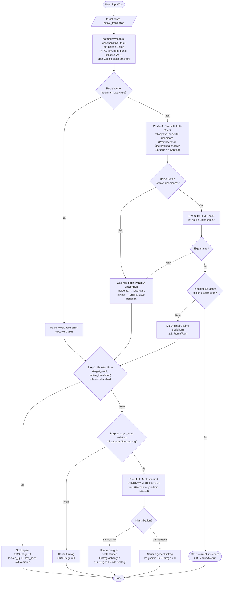

# Disregarded Ideas

Approaches that were considered, designed in detail, sometimes partially implemented, but ultimately replaced by something better. Kept here so we don't re-tread the same paths and so the *why* is preserved if a new constraint ever revives one of them.

---

## Vocab save: native_translation column with Phase A/B casing pipeline + Step 1/2/3 logic

**Date superseded:** 2026-05-09
**Replaced by:** the English-description-anchored save model in `ROADMAP.md` ("Vocabulary save & test").

### What it was

Each vocab row stored both `target_word` and `native_translation`. To handle casing edge-cases (German nouns are always uppercase, Spanish words at sentence start are incidentally so, proper nouns are language-specific) and synonym/polysemy detection, an elaborate LLM pipeline ran at save-time:

**Standard normalisation** (always, deterministic): NFC, trim, edge punctuation strip (Unicode-aware via `\p{P}`), whitespace collapse. The very first pass had to run with `caseSensitive: true` so the original casing survived into Phase A.

**Phase A — per-side "always vs incidental uppercase" check** (LLM call). For every side that started uppercase, ask the model: is this word always uppercase in this language (German noun, proper noun, brand) or just incidentally so (sentence start)? The prompt had to include the other language's translation for context — without that, "Pan" could be either bread (incidental) or a surname (always).

**Phase B — proper-noun filter** (LLM call). Only ran if BOTH sides came back "always" in Phase A. Asked: is this a proper noun? If yes AND the form differs across languages → save with proper case (Roma / Rom). If yes AND identical forms → DO NOT save (Madrid / Madrid, no learning value).

**Step 1 — exact-pair lookup**. After casing was resolved, look for an existing entry with the same `(target_word, native_translation)` for this user. If found, soft-lapse the existing entry (SRS stage − 1).

**Step 2 — same target, different translation?** If found, → Step 3.

**Step 3 — synonym vs polysemy classification** (LLM call). Compare the new translation against the existing one. SYNONYM → append to the existing entry's translation list (joined string like `"Regen / Niederschlag"`, kept as one row). DIFFERENT → new independent row, polysemy.

The worked-examples table (kept for record):

| target | native | Phase A (target) | Phase A (native) | Phase B? | Result |
|---|---|---|---|---|---|
| comer | essen | – | – | no | save (comer / essen) |
| Comer (sentence-start) | essen | "incidental" | – | no | save (comer / essen) |
| comer | Essen (sentence-start) | – | "incidental" | no | save (comer / essen) |
| lluvia | Regen | – | "always" (German noun) | no (only one side) | save (lluvia / Regen) |
| Madrid | Madrid | "always" | "always" | yes → same → **skip** | not saved |
| Roma | Rom | "always" | "always" | yes → different | save (Roma / Rom) |

A separate concept ("disambiguator") was added later: each polysemous row would carry a 1-3-word native-language hint (e.g. `banco (Möbel)` vs `banco (Geld)`). The disambiguator was always shown on test cards for polysemous entries.

### Why disregarded

Two structural issues that ultimately couldn't be designed away:

**1. Native-side casing was a permanent maintenance load.** Phase A on the German side had to handle: German nouns (always upper), sentence-start incidentals, proper nouns, loanwords with mixed conventions, gerunds substantivised mid-sentence. Each rule needed examples; edge cases multiplied as we tried to cover Hungarian/Polish/etc. learners later. The pipeline was 0 LLM calls on the all-lowercase fast path but 2-4 calls on any ambiguous save, with no easy way to monotone-improve.

**2. Synonym merging via concatenated translation strings was awkward data-wise.** `"Regen / Niederschlag"` as one string in `native_translation` lost structure: no per-translation timestamps, no per-translation preference signal, no clean rendering, no clean splitting. The merge was a one-way operation; if the LLM mis-classified synonyms (it does, occasionally), repair required a manual UI.

The replacement model (English description as the canonical sense-key, native translation generated on-demand for the test card flip) eliminates both problems by structure: nothing on the German side is stored, so there's nothing to dedupe or merge. Casing only matters on the target side, where lowercase comparison covers it without an LLM call.

### What was kept (carried forward)

- The *"no lemmatising — store the surface form as encountered"* rule.
- The personalised LLM word ranking via 3-anchor binary search.
- The discrete-stage SRS system (stages 0-6, doubling intervals, two-stage drop on lapse).
- The "soft lapse on re-lookup" idea — but applied based on lowercase match, not exact-pair match.
- The 5-minute cooldown to prevent over-punishing cautious users.
- The polysemy *test*-time logic structure (similar progress → both meanings accepted, diverged progress → push toward the weaker meaning) — but implementation simplified: a negative-hint generated on-demand by LLM replaces the always-on positive disambiguator.

### What was re-decided

- *"Context is not stored"* (old). Now: context IS stored. The original rationale was about *translation* not needing context, which is true. But the English description generator does need context to write a sense-specific description, so we keep it. Useful side-effects: audit trail, possibility of regenerating descriptions if drift is detected, optional UI feature to show the original-encounter sentence as a hint when the learner is stuck.

- *"native_translation column is the source of truth"* (old). Now: nothing on the native side is persisted as schema. Native translations are LLM-computed at test time (cached per row, regenerated only if the underlying description changes). Cost stays in the cents-per-month range even for heavy users.

- *"disambiguator (1-3 words) always shown for polysemes"* (old). Now: nothing shown for polysemes when SRS stages are similar (both meanings accepted). Negative hint shown only when stages diverge (≥2 stages apart) — generated on-demand by LLM, free for monosemous words.

### Old save-flow Mermaid (for reference)

### Code traces left in the repo

- `lib/vocab.ts` — implements `normalizeVocab` and a stub `canonicalizeVocab` with `CasingClassifier` interface for the Phase A/B pipeline. **Not wired** to any save endpoint.
- `tests/vocab.test.ts` — 16 tests covering the Phase A/B logic. **Still pass**, are still useful documentation of the rules even though the production path won't use them.

When the new save model lands, decide: keep `lib/vocab.ts` and the tests as historical reference, or remove them. Recommendation: keep `normalizeVocab` (the pure deterministic part is reusable for the new model's input cleanup); discard `canonicalizeVocab` and the Casing-Classifier-dependent tests.
